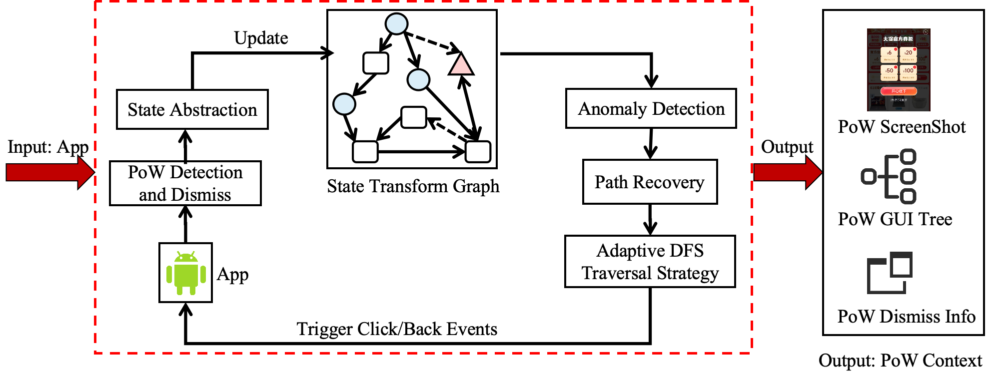
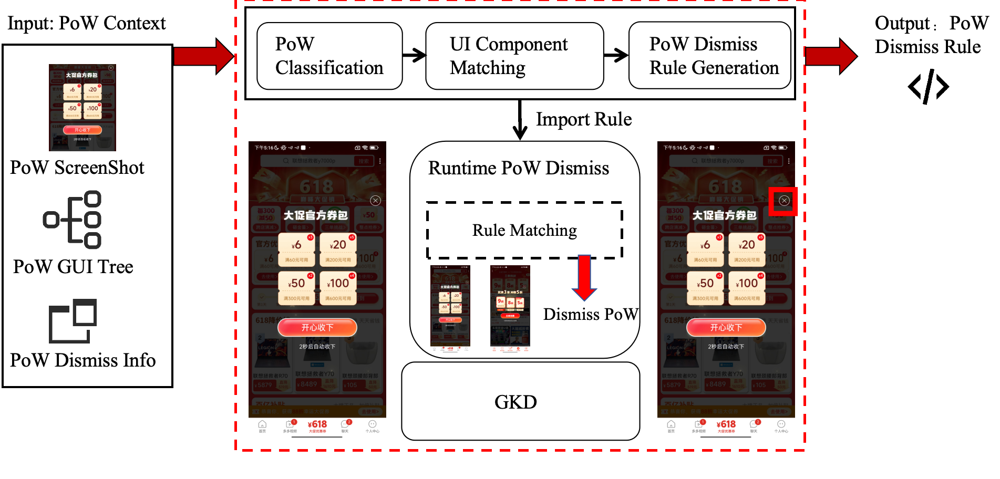

## Contents
1. [Introduction](#introduction)
2. [Related Work](#related-work)
3. [Citation](#citation)
4. [License](#license)

## Introduction
PoW (Pop-up Window) Dataset: 968 real-world commercial app PoWs (collected from 96 applications) with 941 PoW dismissal rules.

1. YOLO-Based Pop-up Detection and Dismissal. This method implements an
efficient pop-up detection and dismissal component recognition mechanism, incorporating
opacity analysis to reduce false positive rates. The F1-score for pop-up window detection
reaches 0.963. For pop-up dismissal, the F1-scores for user-preference components and
app-preference components are 0.965 and 0.976, respectively. Additionally, a three-tiered
backup dismissal strategy is designed to enhance system robustness.
2. Pop-up Collection Method Based on Adaptive Application Traversal. The
study proposes an adaptive traversal strategy with dynamic depth adjustment, integrated
with pop-up detection/dismissal and UI state abstraction to significantly improve collection efficiency. Experimental results demonstrate superior performance over baseline
methods (e.g., Monkey, QTesting) in both pop-up collection capability and data distribution stability. The system achieves an average dismissal time of 3.042 seconds, with 88%
of pop-ups dismissed within 1–2 clicks, while maintaining excellent interface coverage.

    

3. Runtime Pop-up Adversarial Framework Based on Automated Rule Generation. This method leverages the multimodal LLM Gemini for pop-up classification
(94.7% accuracy) and sneaky pop-up identification (92.5% accuracy). Through IoU-based
UI component matching, it automatically generates fine-grained runtime adversarial rules
compatible with GKD. Evaluation results demonstrate a 90.9% adversarial success rate,
with the method generating 2.97 times more rules than existing methods, covering 66%
of their rules.

    

## Related Work
- [**Automatic PoW Collection**](https://github.com/feymanpaper/AppUIAutomator2Navigation)
- [**Runtime PoW Dismiss Rule**](https://github.com/feymanpaper/GKD_subscription)
- [**PoW Dataset**](https://github.com/feymanpaper/UIDarkPatternPopup)

## Citation
Please cite these papers in your publications if UIDarkPatternPopup helps your research.

    @misc{wu2025understandingsneakypatternspopup,
      title={Understanding the Sneaky Patterns of Pop-up Windows in the Mobile Ecosystem}, 
      author={Dongpeng Wu and Yuhong Nan and Shaojiang Wang and Jiawei Wang and Luwa Li and Xueqiang Wang},
      year={2025},
      eprint={2505.12056},
      archivePrefix={arXiv},
      primaryClass={cs.SE},
      url={https://arxiv.org/abs/2505.12056}, 
}

Paper links:
- Understanding the Sneaky Patterns of Pop-up Windows in the Mobile Ecosystem:
    - [ArXiv](https://arxiv.org/abs/2505.12056)

## License
UIDarkPatternPopup is freely available for free non-commercial use.
