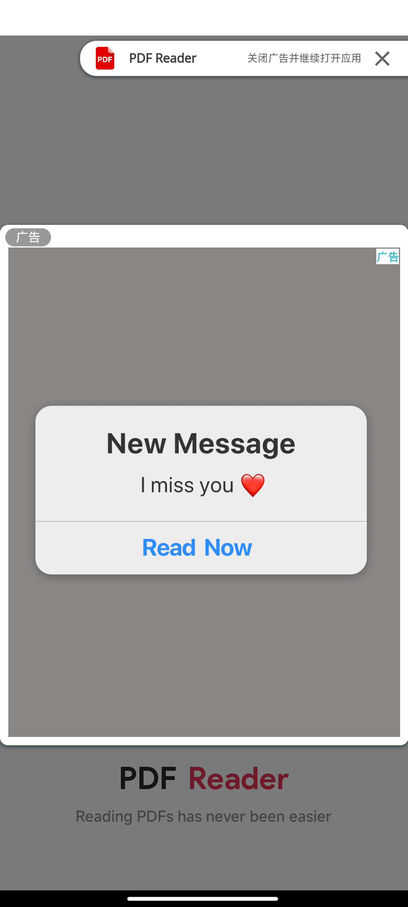
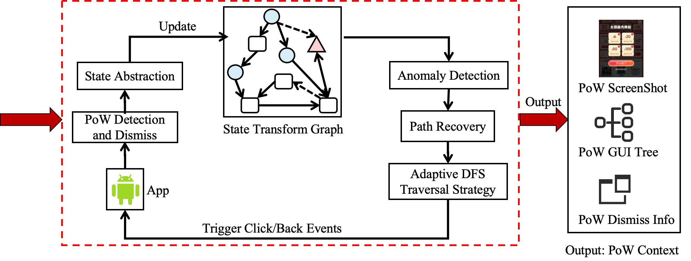
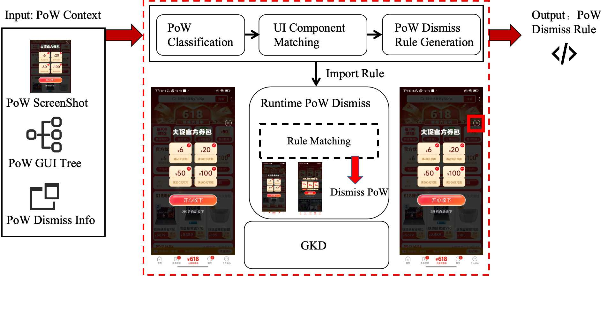

## Contents
1. [Introduction](#introduction)
2. [Related Work](#related-work)
3. [Citation](#citation)
4. [License](#license)

## Introduction
PoW (Pop-up Window) Dataset: 968 real-world commercial app PoWs (collected from 96 applications) with 941 PoW dismissal rules.

Examples: The following examples illustrate common sneaky PoW patterns found in the "All PDF Reader" application. The first case (Fig 1-a) manipulates exit confirmation dialogs by highlighting an irrelevant "Open" button in red while minimizing genuine options, embedding "Free Wi-Fi" ads within system interfaces to create visual-contextual confusion. The second (Fig 1-b) fabricates storage crises by falsely reporting 90%-10% depletion, using threatening prompts ("Your phone will crash") while only displaying a prominent "Clear Cache" button. The third (Fig 1-c) falsely claims PDF incompatibility with Android, displaying an urgent "Fix Now" button while obscuring the close option to drive ad clicks. The fourth (Fig 1-d) mimics SMS notifications ("I miss you") to exploit user curiosity, representing high-risk interface spoofing that enables phishing. Collectively, these patterns demonstrate systematic integration of visual misdirection, false urgency, and contextual manipulation, compromising both usability and security through malware risks, privacy violations, and deceptive dark patterns.

  <table style="display: inline-table; border-collapse: collapse;">
    <tr>
      <td style="padding: 0 15px; text-align: center; vertical-align: top;">
        
        
<b>Fig.1-a</b>

      </td>
      <td style="padding: 0 15px; text-align: center; vertical-align: top;">
        
        
<b>Fig.1-b</b>

      </td>
      <td style="padding: 0 15px; text-align: center; vertical-align: top;">
        
        
<b>Fig.1-c</b>

      </td>
      <td style="padding: 0 15px; text-align: center; vertical-align: top;">
        
        
<b>Fig.1-d</b>

      </td>
    </tr>
  </table>
  

    <b>Figure 1.</b> Sneaky PoW Examples in "All PDF Reader" App.
  

1. YOLO-Based Pop-up Detection and Dismissal. This method implements an
efficient pop-up detection and dismissal component recognition mechanism, incorporating
opacity analysis to reduce false positive rates. The F1-score for pop-up window detection
reaches 0.963. For pop-up dismissal, the F1-scores for user-preference components and
app-preference components are 0.965 and 0.976, respectively. Additionally, a three-tiered
backup dismissal strategy is designed to enhance system robustness.
2. Pop-up Collection Method Based on Adaptive Application Traversal. The
study proposes an adaptive traversal strategy with dynamic depth adjustment, integrated
with pop-up detection/dismissal and UI state abstraction to significantly improve collection efficiency. Experimental results demonstrate superior performance over baseline
methods (e.g., Monkey, QTesting) in both pop-up collection capability and data distribution stability. The system achieves an average dismissal time of 3.042 seconds, with 88%
of pop-ups dismissed within 1–2 clicks, while maintaining excellent interface coverage.

    
      
    <normal><b>Figure 1.</b> Pop-up Collection Method Based on Adaptive Application Traversal.</normal>

3. Runtime Pop-up Adversarial Framework Based on Automated Rule Generation. This method leverages the multimodal LLM Gemini for pop-up classification
(94.7% accuracy) and sneaky pop-up identification (92.5% accuracy). Through IoU-based
UI component matching, it automatically generates fine-grained runtime adversarial rules
compatible with GKD. Evaluation results demonstrate a 90.9% adversarial success rate,
with the method generating 2.97 times more rules than existing methods, covering 66%
of their rules.

    
   
    <normal><b>Figure 2.</b> Runtime Pop-up Adversarial Framework Based on Automated Rule Generation</normal>

## Related Work
- [**Pop-up Collection Method Based on Adaptive Application Traversal.**](https://github.com/feymanpaper/AppUIAutomator2Navigation)
- [**Runtime Pop-up Adversarial Framework Based on Automated Rule Generation.**](https://github.com/feymanpaper/GKD_subscription)
- [**PoW Dataset**](https://github.com/feymanpaper/UIDarkPatternPopup)

## Citation
Please cite these papers in your publications if UIDarkPatternPopup helps your research.

    @misc{wu2025understandingsneakypatternspopup,
      title={Understanding the Sneaky Patterns of Pop-up Windows in the Mobile Ecosystem}, 
      author={Dongpeng Wu and Yuhong Nan and Shaojiang Wang and Jiawei Wang and Luwa Li and Xueqiang Wang},
      year={2025},
      eprint={2505.12056},
      archivePrefix={arXiv},
      primaryClass={cs.SE},
      url={https://arxiv.org/abs/2505.12056}, 
}

Paper links:
- Understanding the Sneaky Patterns of Pop-up Windows in the Mobile Ecosystem:
    - [ArXiv](https://arxiv.org/abs/2505.12056)

## License
UIDarkPatternPopup is freely available freely non-commercial use.
